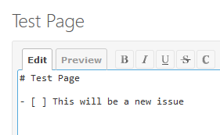
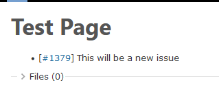
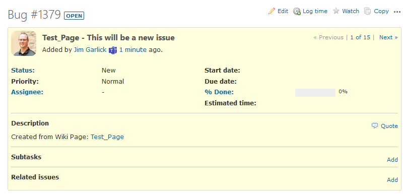

# Redmine Wiki Issues Generator

** **PROTOTYPE PLUGIN - USE AT YOUR OWN RISK** **

This simple [Redmine](https://www.redmine.org/) plugin automatically generates Issues out of lines in your wiki pages that use the Markdown checkbox notation. As it creates the new issues, it modifies the wiki page and adds the issue's ID link into the location. This makes it very easy to maintain strong tracking for tracking actions during meetings or discussions.

## Supported Versions

* Currently only tested in Redmine v5.0.5

## Installation

1. Simply clone this repository into your Redmine's `plugin/` directory.
2. No database migration is needed.
4. Restart Redmine.
5. After restarting, go into your project's settings and enable the `Redmine wiki issue` module.

## Activation

In the "Settings" of each project, check the **Redmine wiki issues** checkbox.

## Usage

Once the plugin is activated, using it is very simple. When you save your Wiki page, the plugin will automatically scan the content and look for any line that begins with the pattern: `- [ ]`. When it encounters this pattern, the plugin will generate a new issue and replace the space inside the backets with the issue number. 

> *Please note: This plugin currently only supports the hyphen-prefixed checkbox. I will add support for the asterisk soon.*

You just need type in the new issue's text:



When you save the wiki, it will create the new issue and replace the space with the issue number:



Redmine already supports hanling creating links out of the issue number automatically. Clicking the link will bring you to the issue. 



The new issue's title is a combination of the name of the source wiki page and the remainder of the line of text. The description contains a link to the source wiki page. And you can now use the issue as you would any other issue.

## Future Enhancements

* Build Unit tests
* Project-level configurations to choose the Tracker for the new Issues
* Create configurable prefixes to match Trackers:
  * `(?)` - 'Question' Tracker
  * `-|*` - 'Task' or 'Epic` Tracker
  * `(!)` - ??

### Task Directives
It might be cool to support special directives in the task line to help organize the tasks that are created. The whole idea for extracting the tasks was to make it easier to manage them. So why not provide some hints? Here are a few ideas:

  * `:assigned @<email>` - Assign the task to that person (Wiki already will help prompt the user)
  * `:due <date|day|phrase>` - Set the due date of the issue to a date or the next named weekday (Ex: `:due monday` or `:due next friday`)
  * `:starts <date|day|phrase>` - Set the start date of the issue
  * `:parent <issue#>` - Set the parent issue to that number
  * `:link <issue#>` - Add a link to the issue number
  * `:category -or- :cat <category name>` - Thinking it might be useful to be able to set the issue's category here. This might need a popup similar to [mentions](https://www.redmine.org/issues/13919).
  
#### Some examples

In a meeting, a note might say:
```
- [ ] Michael should provide the first draft of the proposal by next monday :due monday :assigned michael@ourcompany.biz
```

Another idea could be to add sub tasks to a parent task:
```
- [ ] First step: Get an initial estimate for the proposal :parent #1243
- [ ] Second step: Have architects review the proposal for correctness :parent #1243
```

Some obvious implications of using these directives are, what happens if you make a mistake? Or what happens if you want to come back and edit the wiki line and add a directive? I think for now, it's going to have to be on creation only. There may be ways to help prompt the user for things, but they will only work on the initial creation of the line.

### Tagging

In the Redmine community, there are a lot of options when it comes to tagging. There could be some utility in supporting an open-ended tagging capability to further support organizing our tasks. There are some initial ideas, but there is a lot to research. Watch this space!

### Completed Ideas
* Link back to Wiki page from Issue to help increase the connection between the Issue and the original note
* Name the issue with the Wiki page name prefixed: ('`<wiki name> - <issue title>`')

## Use Cases

1) You're an Avid Redmine User and you have your own personal project to track your daily notes. You've been copying any tasks out of your notes and creating new issues. This works well, but it's a pain and there's a lot of context switching and makes you lose focus on the meeting. This plugin can help you jot down an action, and then later easily provide details in the 

2) You're a part of a dev team and you're in an architecture design session. You're taking notes in the Redmine Wiki and some needs come up in the moment. You take a note to follow up on those actions, but then the meeting progresses and you forget about the tasks. Days later, you remember, but the opportunity has passed. This plugin would have created new issues that you could have added to your backlog.

## License

The source code for the site is licensed under the MIT license, which you can find in the LICENSE.txt file.

